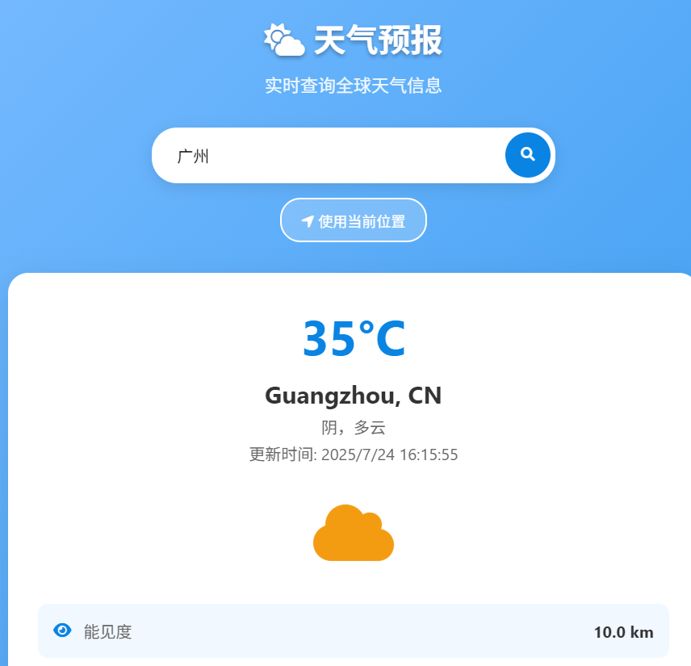
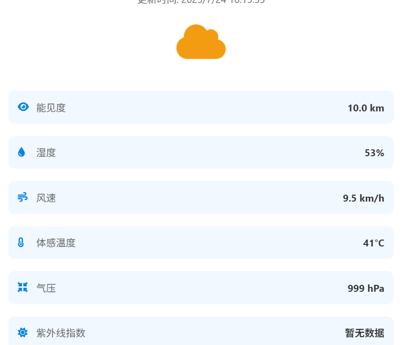
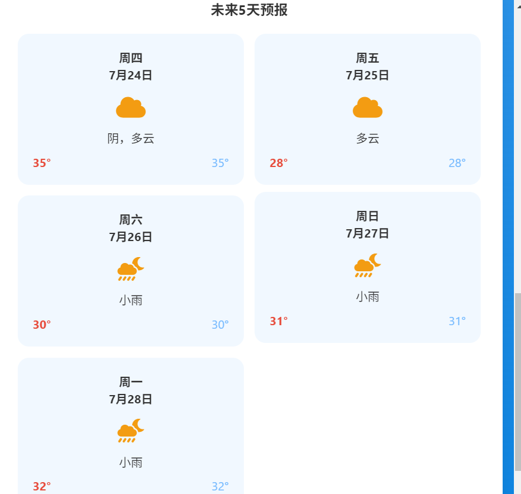

# 天气预报网站

一个现代化的实时天气预报网站，支持全球城市天气查询和当前位置天气获取。




## 功能特点

- 🌤️ **实时天气查询** - 支持全球城市天气信息查询
- 📍 **定位功能** - 自动获取当前位置的天气信息
- 📊 **详细信息** - 显示温度、湿度、风速、气压等详细天气数据
- 📅 **5天预报** - 提供未来5天的天气预报
- 📱 **响应式设计** - 完美适配手机、平板和桌面设备
- 🎨 **现代化界面** - 美观的渐变背景和动画效果

## 技术栈

- **前端**: HTML5, CSS3, JavaScript (ES6+)
- **API**: OpenWeatherMap API
- **图标**: Font Awesome
- **设计**: 响应式设计，CSS Grid 和 Flexbox

## 快速开始

### 1. 获取API密钥

1. 访问 [OpenWeatherMap](https://openweathermap.org/api)
2. 注册账户并获取免费的API密钥
3. 在 `script.js` 文件中替换 `YOUR_API_KEY_HERE` 为您的API密钥

```javascript
const API_KEY = '您的API密钥';
```

### 2. 运行网站

1. 将所有文件放在同一个文件夹中
2. 使用本地服务器运行（推荐）或直接在浏览器中打开 `index.html`

#### 使用Python启动本地服务器：
```bash
# Python 3
python -m http.server 8000

# Python 2
python -m SimpleHTTPServer 8000
```

#### 使用Node.js启动本地服务器：
```bash
npx http-server
```

然后在浏览器中访问 `http://localhost:8000`

## 使用说明

### 搜索天气
1. 在搜索框中输入城市名称（支持中文和英文）
2. 点击搜索按钮或按回车键
3. 查看当前天气和5天预报

### 使用定位
1. 点击"使用当前位置"按钮
2. 允许浏览器获取位置权限
3. 自动显示当前位置的天气信息

## 文件结构

```
weather-app/
├── index.html          # 主页面
├── style.css           # 样式文件
├── script.js           # JavaScript逻辑
└── README.md           # 说明文档
```

## 主要功能模块

### 1. 天气数据获取
- 支持按城市名称查询
- 支持按地理坐标查询
- 错误处理和用户提示

### 2. 界面展示
- 当前天气信息展示
- 详细天气参数显示
- 5天天气预报卡片

### 3. 用户交互
- 搜索功能
- 定位功能
- 加载状态提示
- 错误信息显示

## 自定义配置

### 修改API设置
在 `script.js` 中可以修改以下配置：

```javascript
// API配置
const API_KEY = '您的API密钥';
const API_BASE_URL = 'https://api.openweathermap.org/data/2.5';
```

### 修改样式
在 `style.css` 中可以自定义：
- 颜色主题
- 字体样式
- 布局设计
- 动画效果

## 浏览器兼容性

- Chrome 60+
- Firefox 55+
- Safari 12+
- Edge 79+

## 注意事项

1. **API限制**: 免费的OpenWeatherMap API每分钟有调用次数限制
2. **HTTPS要求**: 地理定位功能需要在HTTPS环境下使用
3. **跨域问题**: 建议使用本地服务器运行，避免跨域问题

## 演示数据

如果没有配置API密钥，网站会显示演示数据，您可以查看界面效果。

## 许可证

MIT License

## 贡献

欢迎提交Issue和Pull Request来改进这个项目！

## 更新日志

### v1.0.0
- 初始版本发布
- 基本天气查询功能
- 响应式设计
- 5天天气预报